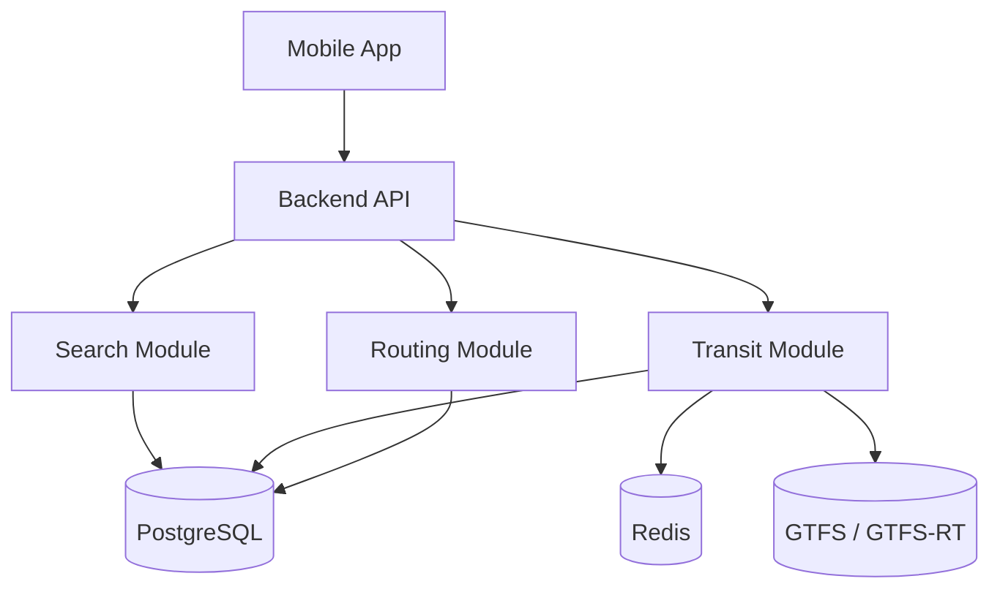

# Arbebus Architecture

## 5 sluoksniai

1. Data layer — PostgreSQL, Redis, GTFS, GTFS-Realtime, POI
2. Business logic — transit engine, search engine, routing engine
3. API layer — Express routes/controllers
4. Map layer — markers, polylines, live vehicle positions
5. UI layer — React Native screens/components

## Pagrindinis srautas

